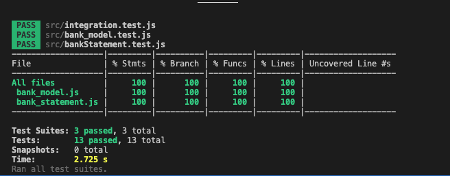
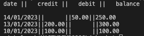

# Bank tech test

This is a tech test as part of Makers course. 
Instructions for this challenge are [here](instructions.md)
The goal for this is to write clean, readable code, with README file that explains how to install dependencies, run the tests and run the project


To run this code you will need Node. If you don't have it installed you can istall it using this commande line in your terminal with brew 

```
$ brew install node
```

[Click here](https://brew.sh/) to get brew.

The following guidance shows how to use NPM to setup and manage a JavaScript project and it's dependencies. 

If you don't have NVM ( Node Version Manager) on your machine [click here](https://github.com/nvm-sh/nvm#installing-and-updating) to install it.

```
# Setup your enviroment to use the latest version 

$ nvm use node

# Initialize the NPm project

$ npm init -y

# Add jest package 

$ npm add jest

# Install jest 'globally'

$npm install -g jest 

# To run tests 

$ jest
```

## Running the app

To run the app and see bank statment type in your terminal. 
```
 node app.js 
```
If you want to add more money or withdraw money update app.js

## Example:
 
 
```javaScript
//I want to deposit money
statement.deposit('12/03/2023', 1000)

//I want to do withdraw money 
statement.withdraw('13/03/2023', 200)
```


Test coverage:



To run the test coverage use this command line in the terminal: 

```
npm test -- --coverage
```

Output:

